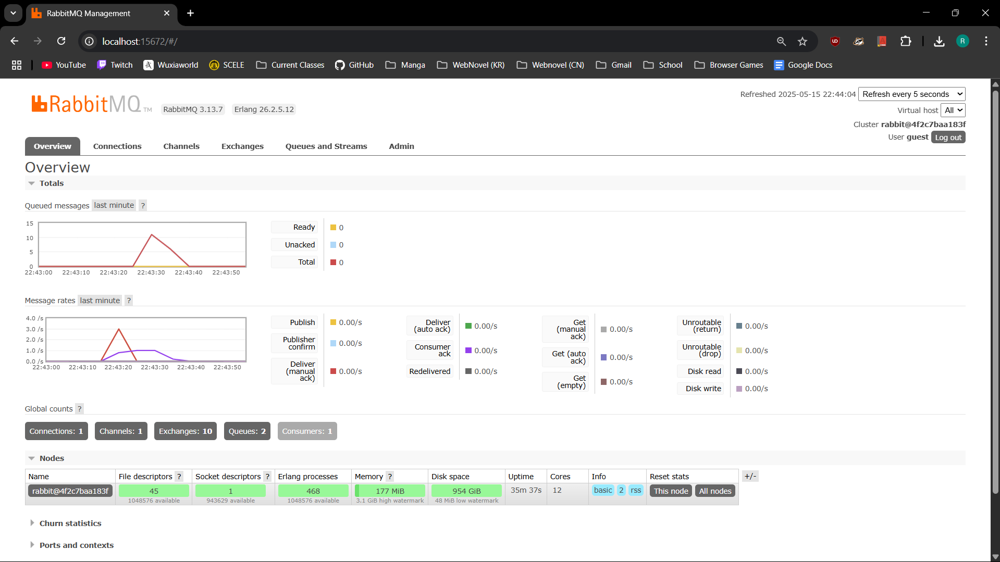
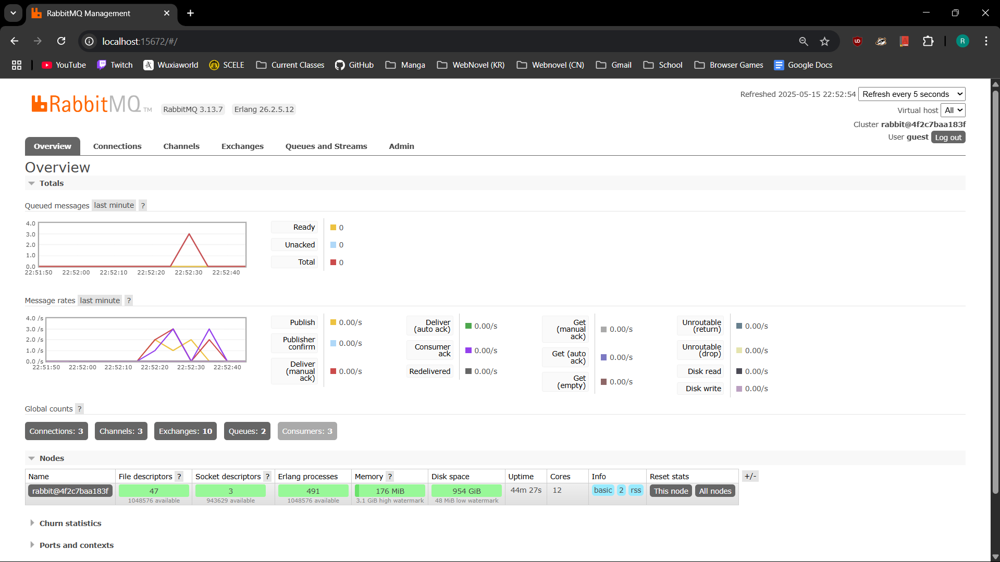

# Reflection Modul 9
Ragnall Muhammad Al Fath
2306210550 / AdPro B
---

### 1. What is amqp?

AMQP (Advanced Message Queuing Protocol) is an open standard protocol for message-oriented middleware. It enables applications to communicate by exchanging messages regardless of programming language, making it ideal for distributed systems.

### 2. What does it mean? guest:guest@localhost:5672 , what is the first guest, and what is the second guest, and what is localhost:5672 is for?

First guest: Username for authentication
Second guest: Password for authentication
localhost:5672: Where the AMQP broker (like RabbitMQ) is running
localhost: the local machine
5672: standard AMQP port
This connection string instructs your application to connect to an AMQP broker running locally using default credentials.

### Simulation Slow Subscriber

In my simulation, I ran the publisher three times, sending a total of 15 messages (5 messages per run). The RabbitMQ management interface shows a peak of approximately 10 messages in the queue at one time, rather than the full 15 messages. 

This occurs because:

1. The subscriber is actively processing messages while new ones arrive
2. Due to the 1-second sleep delay in the subscriber, messages accumulate temporarily
3. The queue represents only unacknowledged messages - those sent but not yet fully processed
4. The subscriber gradually processes the backlog between publisher runs

The queue count eventually returns to zero once all messages are processed, showing that the message broker successfully handled the temporary backlog caused by the slow consumer.

In my testing, the maximum queue size reached about 10 messages, demonstrating how RabbitMQ effectively manages the difference in speed between publishers and subscribers.

### Three Subscribers

When running three subscriber instances simultaneously with multiple publisher runs, the queue is depleted significantly faster than with a single subscriber. This occurs because:

1. Parallel Processing: Three subscribers process messages concurrently, tripling throughput
2. Load Distribution: RabbitMQ automatically distributes messages among all available consumers
3. Faster Queue Resolution: Even with the 1-second processing delay in each subscriber, the collective processing power reduces backlog more quickly
4. Resource Utilization: System resources are better utilized with multiple consumers

Potential Code Improvements

Subscriber Improvements:

1. Make processing delay configurable rather than hardcoded
2. Implement proper error handling for failed message processing
3. Complete the get_handler_action() method instead of using todo!()

Publisher Improvements:

1. Add proper error handling around connection and publishing operations
2. Implement batch message publishing for better efficiency
3. Use configuration for connection parameters rather than hardcoded values
4. Add confirmation handling to ensure messages are properly delivered

These improvements would enhance reliability, configurability, and maintainability of the messaging system.